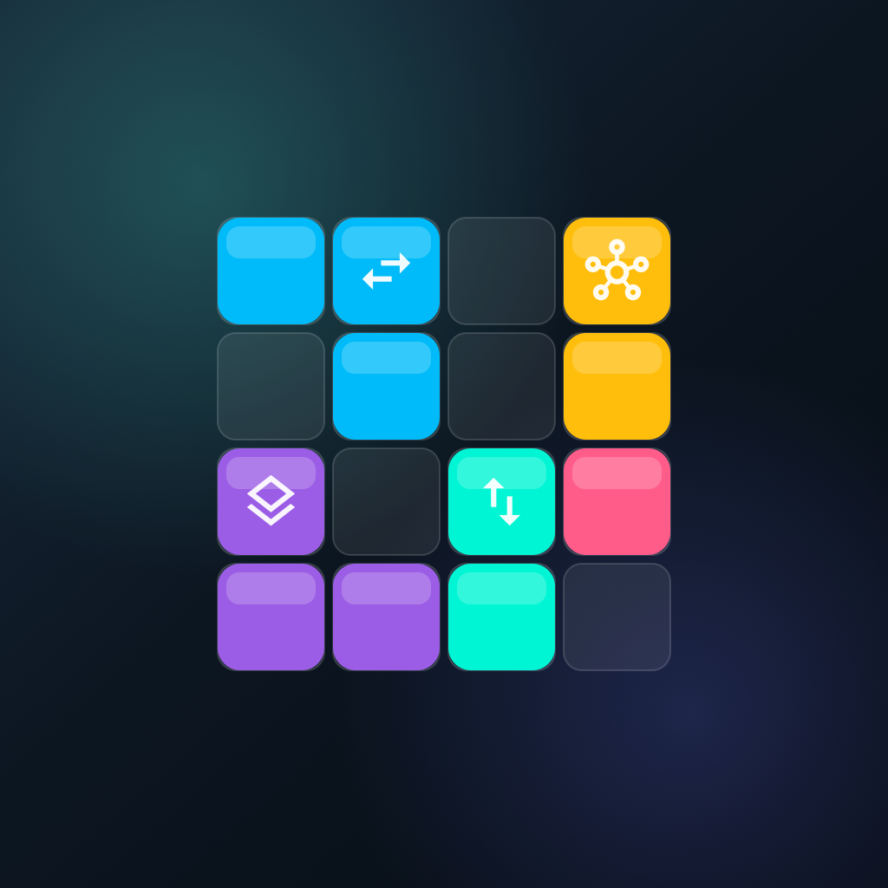

# StackShift

<p align="center">
  
</p>

StackShift is a reverse-Tetris inspired puzzle game built with **Kotlin** and **Compose Multiplatform** for **Android, iOS, Web, macOS, Windows, and Desktop JVM**.

## Quick links

- [Overview](#overview)
- [Screenshots](#screenshots)
- [Features](#features)
- [Controls](#controls)
- [Project structure](#project-structure)
- [Requirements](#requirements)
- [Run commands](#run-commands)
- [Downloadable builds](#downloadable-builds)
- [Validation](#validation)
- [Notes](#notes)

## Overview

Instead of falling from the top, pieces spawn near the bottom of the board. You drag them into place, the game snaps them to the nearest valid grid position, and completed rows are cleared for points, combos, and increasing pressure.

## Screenshots

Add board screenshots here when they are ready.

| Theme | Screenshot path |
| --- | --- |
| Dark board | [`./docs/screenshots/board-dark.png`](./docs/screenshots/board-dark.png) |
| Light board | [`./docs/screenshots/board-light.png`](./docs/screenshots/board-light.png) |

## Features

- **Drag-first gameplay** with touch and mouse support.
- **Placement preview** that shows the landing footprint before release.
- **Soft-lock placement flow** that lets you adjust the active piece before it is committed.
- **Special block types** with dedicated icons and behavior hints.
- **Score, combo, and line-clear feedback** with animated HUD and board effects.
- **Theme and visual customization** for colors, block styles, and board styling.
- **Pause, resume, restart, and hold** controls in the top HUD.
- **Multiplatform UI** shared across Android, iOS, macOS, Windows, and Desktop JVM.

## Controls

- **Drag** the active piece onto the board.
- **Release** to place it, or return to the spawn area if the position is invalid.
- **Pause** / **Resume** and **Restart** are available from the top HUD.
- **Settings** lets you adjust theme and gameplay visuals.

## Project structure

Shared code lives in [`composeApp/src/commonMain/kotlin`](./composeApp/src/commonMain/kotlin).

- `game/model`
  - Immutable game data such as `GameState`, `BoardMatrix`, `Piece`, and `PlacementPreview`.
- `game/logic`
  - Pure gameplay rules: spawning, collision, snapping, clearing, scoring, and difficulty.
- `ui/game`
  - Compose UI for the board, HUD, tray, settings, and in-game overlays.
- `settings`
  - App settings model and persistence helpers.
- `localization`
  - Shared localization access for UI text.
- `ui/theme`
  - Theme palette helpers and Compose Material theme wiring.

Platform-specific entry points live in:

- [`composeApp`](./composeApp/src)
  - Shared Compose Multiplatform app code and platform hosts.
- [`iosApp`](./iosApp/iosApp)
  - iOS entry point used by Xcode.

## Requirements

- A recent **JDK** compatible with the Gradle setup.
- **Android Studio** for Android development.
- **Xcode** for iOS and macOS builds.
- **Windows** support if you want to package the Windows desktop target.

## Full build prerequisites

Use the full build flow when you want Gradle to attempt every supported platform and collect the successful outputs into `artifacts/`.

- **Android**
  - Android SDK must be configured in `local.properties`.
  - Android Studio or command-line Android tooling must be available.
- **iOS**
  - Run on macOS with **Xcode** installed.
  - The iOS archive step uses `xcodebuild`.
- **macOS desktop**
  - Run on macOS with a full **JDK** that includes `jpackage`.
- **Windows desktop**
  - Run on Windows or a Windows CI runner to produce the MSI package.

If you are not on the target platform, the task still attempts the build and continues with the remaining platforms after failures.

## Setup

Clone the repository and open it in your IDE, then let Gradle sync the project.

```sh
./gradlew build
```

## Full build

To generate all available artifacts in one run, use:

```sh
./gradlew buildAllArtifacts
```

This task attempts Android, iOS, macOS, and Windows builds in sequence, continues after individual failures, and copies any successful outputs into the local `artifacts/` directory.

The `artifacts/` directory is ignored by Git again, so the generated files stay local unless you explicitly change that policy.

## Run commands

### Android

```sh
./gradlew :composeApp:assembleDebug
```

### Desktop (JVM)

```sh
./gradlew :composeApp:run
```

### Web

Run the browser dev server directly:

```sh
./gradlew :composeApp:wasmJsBrowserDevelopmentRun
```

Or use the shortcut task:

```sh
./gradlew :composeApp:runWeb
```

Build the browser development bundle without starting the server:

```sh
./gradlew :composeApp:wasmJsBrowserDevelopmentWebpack
```

The generated web assets are placed under:

- `composeApp/build/kotlin-webpack/wasmJs/developmentExecutable/`

### Desktop distributable app image

```sh
./gradlew :composeApp:packageDesktopApp
```

This creates a portable desktop app image under `composeApp/build/compose/binaries/main/app/` for the current platform.

### iOS simulator compile check

```sh
./gradlew :composeApp:compileKotlinIosSimulatorArm64
```

To run the full iOS app, open [`iosApp`](./iosApp) in Xcode and launch it from there.

## Downloadable builds

Use the commands below to generate runnable files and share them with others.

For the full multi-platform flow, prefer `./gradlew buildAllArtifacts` instead of running each command manually.

| Platform | Command | Artifact location |
| --- | --- | --- |
| Android APK | `./gradlew :composeApp:assembleDebug` | [`composeApp/build/outputs/apk/debug/composeApp-debug.apk`](./composeApp/build/outputs/apk/debug/composeApp-debug.apk) |
| Android release APK | `./gradlew :composeApp:assembleRelease` | [`composeApp/build/outputs/apk/release/`](./composeApp/build/outputs/apk/release/) |
| iOS app / IPA | Open `iosApp` in Xcode, then use **Product > Archive** and export from Organizer | [`artifacts/ios/StackShift.xcarchive`](./artifacts/ios/StackShift.xcarchive) and `~/Library/Developer/Xcode/Archives/` for Xcode archives |
| macOS app image | `./gradlew :composeApp:packageDesktopApp` | [`composeApp/build/compose/binaries/main/app/`](./composeApp/build/compose/binaries/main/app/) |
| macOS DMG | `./gradlew :composeApp:packageDmg` | [`composeApp/build/compose/binaries/main/dmg/`](./composeApp/build/compose/binaries/main/dmg/) |
| Windows MSI | `./gradlew :composeApp:packageMsi` | [`composeApp/build/compose/binaries/main/msi/`](./composeApp/build/compose/binaries/main/msi/) — requires a Windows machine or Windows CI runner |

## Validation

These are the commands used to verify the shared code and platform targets:

```sh
./gradlew build
./gradlew :composeApp:compileDebugKotlinAndroid
./gradlew :composeApp:compileKotlinJvm :composeApp:jvmTest
./gradlew :composeApp:compileKotlinIosSimulatorArm64
./gradlew :composeApp:compileDevelopmentExecutableKotlinWasmJs
```

## Notes

- The sound and haptic layer is intentionally abstract so platform-specific implementations can be added later without changing shared game logic.
- The board uses a compact array-backed representation to keep collision and row-clear checks efficient.
- Gradle may still show Compose Multiplatform / KMP deprecation warnings depending on the toolchain, but the project builds successfully.
