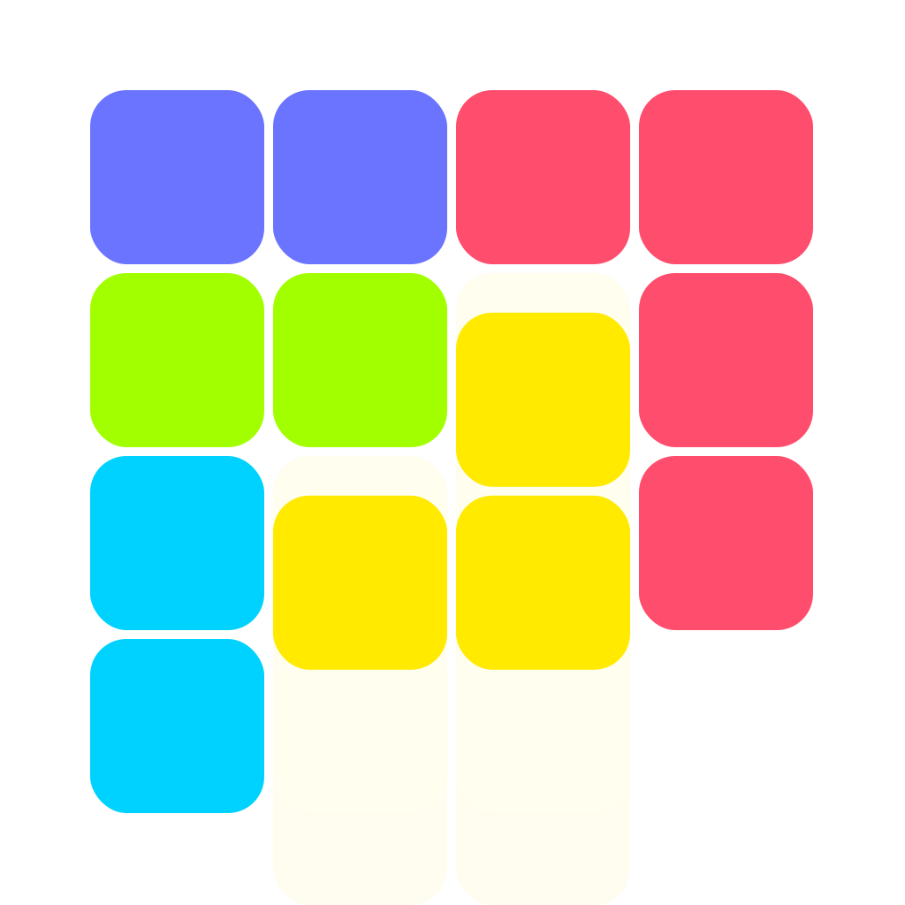
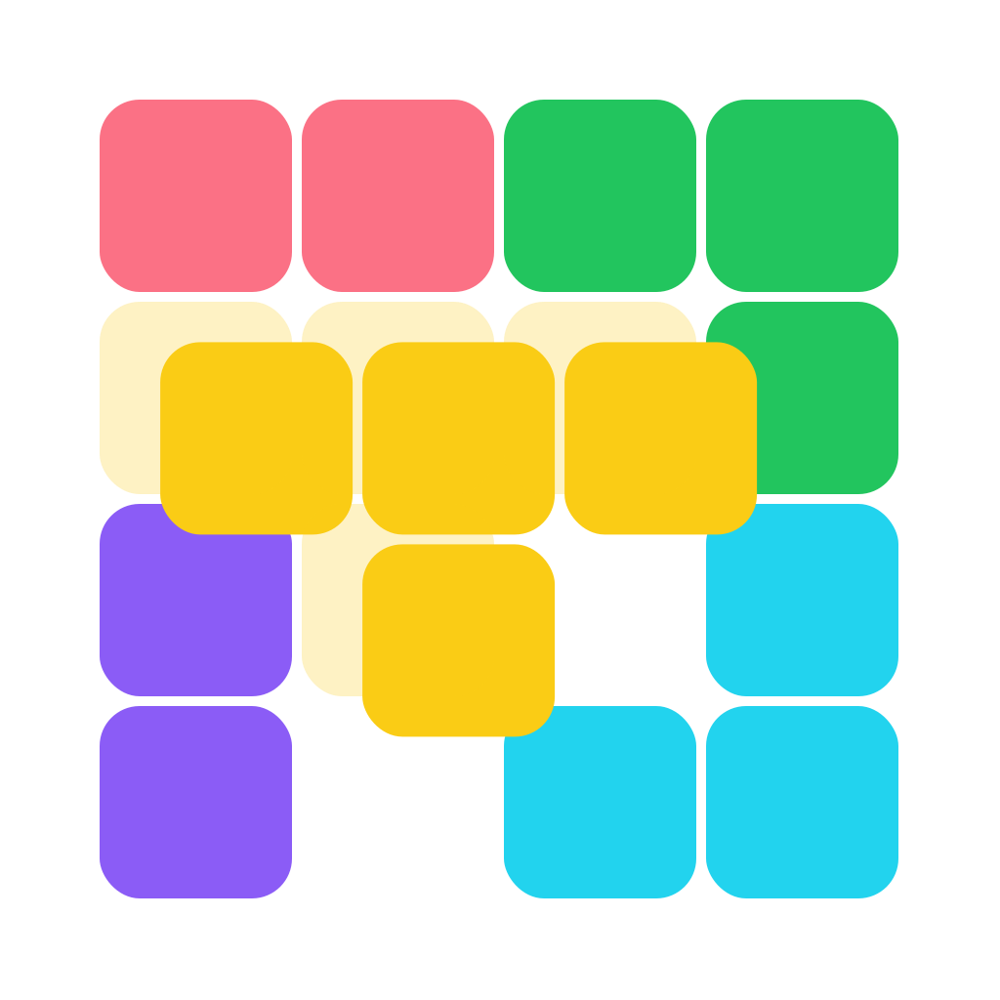
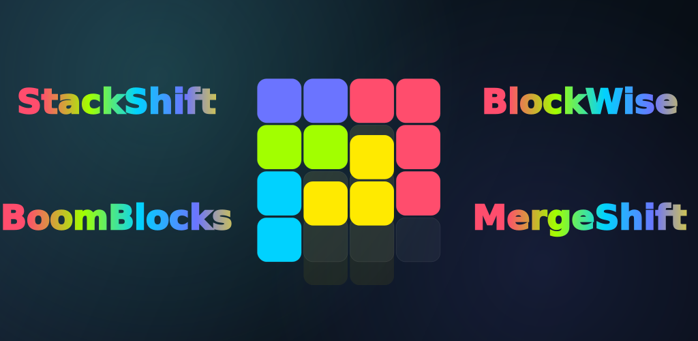
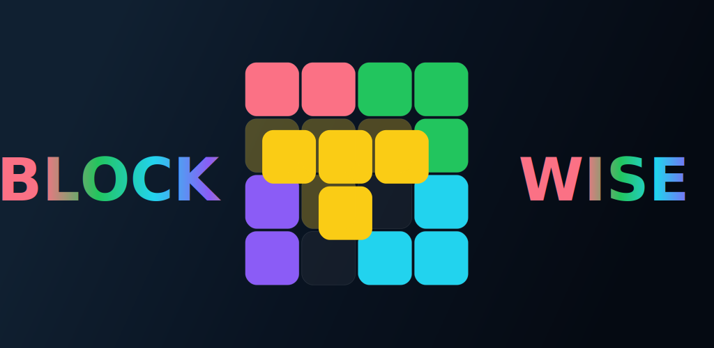

# BlockGames

<p align="center">
  
  
</p>

BlockGames is a collection of modern puzzle games built with **Kotlin** and **Compose Multiplatform** for **Android, iOS, Web, macOS, Windows, and Desktop JVM**. It features two unique game modes: **StackShift** and **BlockWise**.

## Quick links

- [Game Modes](#game-modes)
- [Working Logic](#working-logic)
- [Screens](#screens)
- [Features](#features)
- [Project Structure](#project-structure)
- [Requirements](#requirements)
- [Run Commands](#run-commands)
- [Downloadable Builds](#downloadable-builds)

## Game Modes

### StackShift
<p align="center">
  <br/>
  <a href="https://play.google.com/store/apps/details?id=com.ugurbuga.stackshift">
    
  </a>
</p>

Experience a gravity-defying twist on the classic block puzzle genre. In **StackShift**, pieces don't fall from the sky; they emerge from the bottom of your screen, waiting for your tactical touch. 

*   **Reverse-Gravity Strategy**: Drag pieces from the spawn tray and place them anywhere on the grid.
*   **Precision Placement**: Use the real-time "Footprint Preview" to see exactly where your block will land before committing.
*   **Clear & Conquer**: Fill horizontal lines to clear them from the board. Chain multiple clears to trigger massive score multipliers.
*   **Specialized Blocks**: Encounter unique blocks like Column Clearers, Row Clearers, and Heavy Blocks that change the flow of the game.

### BlockWise
<p align="center">
  
</p>

A meditative yet deeply challenging spatial puzzle designed to test your logic and board management skills. **BlockWise** strips away the pressure of falling pieces, giving you the time to plan the perfect move.

*   **Multi-Directional Clearing**: Unlike many puzzles, BlockWise allows you to clear lines both **horizontally and vertically**.
*   **Strategic Selection**: You are presented with a set of pieces in your tray. Choose the order and position wisely to avoid locking the board.
*   **Combo System**: Clear multiple lines in a single move to achieve "Mega Clears" and skyrocket your high score.
*   **Fluid Gameplay**: Optimized for touch and mouse, providing a seamless and satisfying tactile experience as pieces snap perfectly into place.

## Working Logic

The application follows a clean, reactive architectural pattern powered by Compose Multiplatform:

1.  **Drag-and-Drop Entry**: All gameplay starts with a touch or mouse drag. The `game/logic` layer calculates valid positions in real-time.
2.  **Placement Preview**: Before releasing, the UI renders a high-contrast footprint showing exactly where the piece will land.
3.  **Collision & Snapping**: The logic ensures pieces never overlap and automatically snaps them to the grid for a satisfying tactile feel.
4.  **Clearing & Scoring**: When a line (horizontal in StackShift, both ways in BlockWise) is filled, the board triggers an animation, clears the blocks, and updates the score/multiplier state.
5.  **Multiplatform Core**: 100% of the game logic and 95% of the UI code is shared across all platforms.

## Screens

-   **Home**: The central hub where you can choose between StackShift and BlockWise game modes.
-   **Game Screen**: The main board featuring an interactive grid, piece spawn/tray area, and real-time score HUD.
-   **Daily Challenge**: A dedicated mode with unique puzzle setups that refresh every 24 hours.
-   **Settings**: A deep customization menu for themes (Dark/Light), block styles, haptics, and visual effects.
-   **Onboarding**: Guided tutorials that introduce new players to the unique mechanics of each game.

## Features

-   **Drag-first gameplay** with high-precision touch and mouse support.
-   **Special block types** including column clearers, row clearers, and heavy blocks.
-   **Animated HUD** providing immediate feedback on scores, combos, and multipliers.
-   **Multi-theme support** with vibrant color palettes and custom block designs.
-   **Pause/Resume/Restart** controls with state persistence.
-   **Multiplatform UI** optimized for mobile, desktop, and web screen ratios.

## Project Structure

Shared code lives in [`composeApp/src/commonMain/kotlin`](./composeApp/src/commonMain/kotlin).

-   `game/model`: Immutable data classes (`GameState`, `BoardMatrix`, `Piece`).
-   `game/logic`: Pure functional rules for spawning, collision, and scoring.
-   `ui/game`: Multiplatform Compose UI components.
-   `settings`: Persistence and preference management.
-   `localization`: Multi-language support.
-   `ui/theme`: Dynamic palette and Material 3 design system integration.

## Requirements

-   **JDK 17+**
-   **Android Studio** (for Android)
-   **Xcode** (for iOS/macOS)
-   **Windows 10/11** (for Windows builds)

## Run Commands

### Android
```sh
./gradlew :composeApp:assembleDebug
```

### Desktop (JVM)
```sh
./gradlew :composeApp:run
```

### Web (Wasm)
```sh
./gradlew :composeApp:runWeb
```

### iOS
Open the `iosApp` folder in Xcode to run on a simulator or physical device.

## Downloadable Builds

| Platform | Command | Artifact location |
| --- | --- | --- |
| Android APK | `./gradlew :composeApp:assembleDebug` | `composeApp/build/outputs/apk/debug/` |
| macOS DMG | `./gradlew :composeApp:packageDmg` | `composeApp/build/compose/binaries/main/dmg/` |
| Windows MSI | `./gradlew :composeApp:packageMsi` | `composeApp/build/compose/binaries/main/msi/` |

## Notes

-   The sound and haptic layer is intentionally abstract for platform-specific implementations.
-   The board uses a compact array-backed representation for high-performance collision checks.
